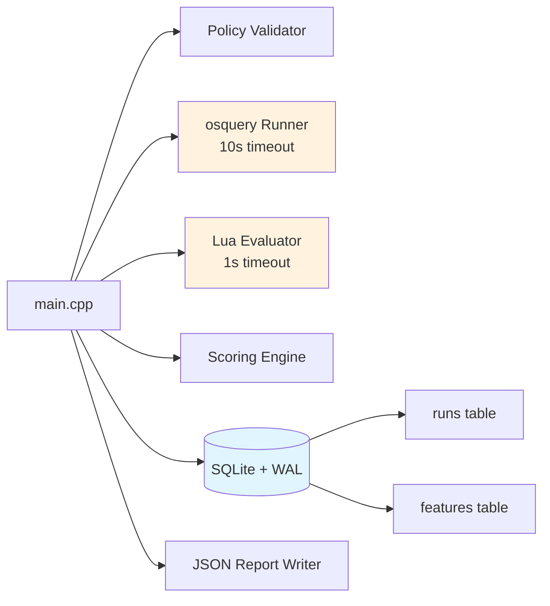

# Sentinel

[](LICENSE)

**Sentinel is a security compliance evaluation agent demonstrating deterministic policy evaluation, durable persistence, and clean architectural patterns.**

This project showcases engineering thinking for agent-based systems: crash-safe persistence (SQLite WAL), sandboxed rule execution (Lua), and separation of concerns. It's structured as a two-phase implementation to demonstrate both working code (Phase 1) and architectural planning (Phase 2 includes explicit state machines for delivery).

---

## Project Status

### Phase 1: Local Evaluation Engine ✅ **IMPLEMENTED**

Currently built and working:

- **Deterministic Policy Evaluation**: osquery data collection + Lua rule engine + weighted scoring
- **Crash-Safe Persistence**: SQLite with WAL mode, atomic transactions
- **Sandboxed Rule Execution**: Lua runtime with timeout enforcement (1s), no I/O access
- **Resource Bounds**: osquery timeout (10s), memory limits, 1MB output cap
- **Structured Reporting**: JSON output with ISO-8601 timestamps, hostname detection
- **Clean Architecture**: Separation between data collection, rule evaluation, scoring, persistence

**Database Schema (Current):**
```sql
CREATE TABLE runs (
  id INTEGER PRIMARY KEY AUTOINCREMENT,
  ts TEXT NOT NULL,
  hostname TEXT,
  policy TEXT,
  score INTEGER,
  details_json TEXT
);

CREATE TABLE features (
  run_id INTEGER PRIMARY KEY,
  firewall_enabled INTEGER,
  av_installed INTEGER,
  FOREIGN KEY(run_id) REFERENCES runs(id)
);

-- Phase 2: Delivery layer
CREATE TABLE retry_queue (
  run_id INTEGER PRIMARY KEY,
  report_hash TEXT UNIQUE NOT NULL,
  report_json TEXT NOT NULL,
  attempts INTEGER DEFAULT 0,
  state TEXT NOT NULL CHECK (state IN ('PENDING', 'DELIVERED', 'FAILED')),
  next_retry_at TEXT,
  created_at TEXT NOT NULL,
  delivered_at TEXT,
  failed_at TEXT,
  last_error TEXT,
  FOREIGN KEY(run_id) REFERENCES runs(id)
);
```

### Phase 2: Delivery Layer 🔄 **IN PROGRESS**

**Delivery Foundation** ✅ (Branch: `feature/delivery-foundation`)
- ✅ Retry queue database schema (3-state: PENDING/DELIVERED/FAILED)
- ✅ SHA-256 content hashing (deterministic, standalone implementation)
- ✅ DeliveryClient interface + MockDeliveryClient
- ✅ Queue operations (enqueue, load, mark delivered/failed)
- ✅ Integration tests passing

**Next:** HTTP delivery client, MQTT delivery client, retry queue manager

**Remaining features** (documented in [`docs/roadmap/`](docs/roadmap/)):

- **At-Least-Once Delivery**: Durable retry queue with exponential backoff
- **Content-Addressable Deduplication**: SHA-256 hashing for idempotent backend processing
- **Protocol Abstraction**: Pluggable transports (MQTT QoS 1 primary, HTTP fallback)
- **Crash Recovery**: Resume delivery of persisted reports after agent restart
- **Explicit State Machine**: PENDING → RETRY → DELIVERED → FAILED states
- **Idempotent Backend**: Minimal FastAPI server with hash-based deduplication

**Timeline:** 10-12 days focused work

**Planning Docs:**
- [Implementation Plan](docs/roadmap/IMPLEMENTATION_PLAN.md) - 10-day phased approach
- [Code Modules](docs/roadmap/CODE_MODULES.md) - Module architecture (~600 LOC total)
- [Delivery State Machine](docs/roadmap/delivery-state-machine.md) - State transitions
- [Failure Scenarios](docs/roadmap/failure-scenarios.md) - Network/crash recovery patterns
- [Delivery Guarantees](docs/roadmap/delivery-guarantees.md) - Formal specifications

---

## Current Capabilities (Phase 1)

### Policy Evaluation

Policies define security rules using osquery for data collection and Lua for evaluation logic:

```json
{
  "policy_name": "windows-security-baseline",
  "base_score": 100,
  "rules": [
    {
      "id": "firewall_enabled",
      "desc": "Windows Firewall must be enabled",
      "query": "SELECT state FROM windows_security_products WHERE type='Firewall'",
      "lua": "return results[1].state == 'On'",
      "weight": 20
    }
  ]
}
```

### Execution Flow (Current)

1. **Load Policy**: Parse JSON policy file, validate schema
2. **Collect Data**: Execute osquery with 10s timeout
3. **Evaluate Rules**: Run Lua code in sandboxed environment (1s timeout)
4. **Compute Score**: Weighted sum of passing rules
5. **Persist**: Atomic SQLite transaction (WAL mode)
6. **Report**: Write JSON to `reports/latest_report.json`

### Example Output

```json
{
  "policy": "sample-default-windows",
  "score": 75,
  "details": {
    "firewall_enabled": true,
    "av_installed": true,
    "security_center_status": false
  },
  "timestamp": "2026-02-18T10:30:00.123Z",
  "hostname": "DESKTOP-WIN10"
}
```

### Current Guarantees

**What Sentinel Currently Guarantees:**

- ✅ **Deterministic Evaluation**: Same policy + same system state = same score
- ✅ **Crash-Safe Persistence**: SQLite WAL ensures committed data survives crashes
- ✅ **Sandboxed Execution**: Lua runtime has no file/network I/O, enforced timeouts
- ✅ **Resource Bounds**: CPU/memory/disk usage limited by timeouts and output caps
- ✅ **Offline Operation**: Agent works without network (local evaluation only)

**What Sentinel Does NOT Currently Guarantee:**

- ❌ **Delivery to Backend**: No network layer exists yet (Phase 2)
- ❌ **Crash Recovery for Delivery**: No retry queue exists (Phase 2)
- ❌ **At-Least-Once Semantics**: No delivery tracking (Phase 2)
- ❌ **Idempotent Processing**: No hashing or deduplication (Phase 2)

---

## Quick Start

### Prerequisites

- **Visual Studio 2022** with C++ build tools (Windows)
- **[vcpkg](https://github.com/microsoft/vcpkg)** with packages:
  ```
  vcpkg install nlohmann-json spdlog sol2 lua sqlite3
  ```
- **[osquery](https://osquery.io/downloads/official)** installed and `osqueryi.exe` in `PATH`

**Optional Tools:**
- **sqlite3 CLI** (for manual database inspection): `winget install SQLite.SQLite`
  - Not required for building or testing
  - Tests validate schema automatically

### Build

**PowerShell 7** (recommended):
```powershell
.\scripts\build.ps1 -Config Debug
```

**Command Prompt**:
```bat
scripts\build.bat
```

### Run

**PowerShell 7**:
```powershell
.\scripts\run.ps1 -Policy policies\sample_policy.json
```

**Command Prompt**:
```bat
scripts\run.bat policies\sample_policy.json
```

### Smoketest

```powershell
.\scripts\smoketest.ps1
```

Validates: Build succeeds, execution completes, report generated, database persisted.

---

## Testing & CI

### Quick Validation (5 minutes)

Before committing, run the three core checks:

```powershell
.\scripts\build.ps1   # Clean build
.\scripts\test.ps1    # Integration tests (13 assertions)
.\scripts\run.ps1     # Phase 1 backward compatibility
```

**See:** [docs/QUICK_TEST.md](docs/QUICK_TEST.md) for quick reference.

### Comprehensive Pre-Commit Testing (10-15 minutes)

Before merging to master, run full validation including:
- Build integrity (Debug + Release)
- Edge case testing
- CLI argument variations
- Database schema verification

**See:** [docs/PRE_COMMIT_TESTING.md](docs/PRE_COMMIT_TESTING.md) for complete checklist.

### Integration Tests

Run delivery foundation integration tests:

**PowerShell 7**:
```powershell
.\scripts\test.ps1
```

**Command Prompt**:
```bat
scripts\test.bat
```

**Or directly**:
```powershell
.\build\Debug\test_delivery_foundation.exe
```

**Tests cover:**
- SHA-256 hash determinism (sorted JSON keys)
- MockDeliveryClient success/failure modes
- Retry queue operations (enqueue, load, mark delivered/failed)
- UNIQUE constraint on report_hash
- Dynamic timestamp handling (prevents test decay)
- End-to-end flow (persist → hash → enqueue → deliver)

### Continuous Integration

GitHub Actions workflow runs on every push/PR to master:
- ✅ Build (Release + Debug)
- ✅ Run integration tests
- ✅ Upload build artifacts

See [`.github/workflows/windows-build.yml`](.github/workflows/windows-build.yml) for details.

---

## Architecture (Current Implementation)



**See:** [architecture/README.md](architecture/README.md) for detailed component descriptions.

---

## Performance Characteristics (Phase 1)

**Observed during local testing (Windows 10, i7-8750H, 16GB RAM):**

- **CPU**: 3% average, 25% peak (during osquery execution)
- **Memory**: 45MB RSS
- **Disk**: ~5ms write latency (SQLite WAL mode)
- **Execution Time**:
  - Policy validation: <1ms
  - osquery execution: 50-200ms (query-dependent)
  - Lua evaluation: <1ms per rule
  - SQLite transaction: 1-5ms

**Capacity (Single Agent):**
- SQLite: ~10k writes/sec (far exceeds single-agent needs)
- Evaluation rate: Limited by policy complexity and osquery queries (typically 1-10/min suffices)

---

## Project Structure

```
Sentinel/
├── src/
│   ├── main.cpp              # Orchestration and evaluation flow
│   ├── osquery_runner.cpp    # osquery execution with timeout
│   ├── lua_evaluator.cpp     # Sandboxed Lua runtime
│   ├── scoring.cpp           # Weighted score computation
│   ├── db.cpp                # SQLite persistence (WAL mode)
│   └── json_to_lua.cpp       # JSON-Lua conversion
├── policies/
│   └── sample_policy.json    # Example Windows security policy
├── architecture/
│   └── README.md             # Current system architecture
├── docs/
│   ├── trade-offs.md         # Architectural decisions (current)
│   └── roadmap/              # Phase 2 planning docs
│       ├── IMPLEMENTATION_PLAN.md
│       ├── CODE_MODULES.md
│       ├── delivery-state-machine.md
│       ├── failure-scenarios.md
│       └── delivery-guarantees.md
├── reports/
│   └── latest_report.json    # Last evaluation result
├── sentinel_data.sqlite3     # Local database
└── scripts/
    ├── build.ps1 / build.bat
    ├── run.ps1 / run.bat
    └── smoketest.ps1 / smoketest.bat
```

---

## Why This Project Structure?

**Phase 1** demonstrates:
- Clean working code (no vaporware)
- Crash-safe state management (SQLite WAL)
- Security-focused design (sandboxing, timeouts, resource limits)
- Real-world constraints (osquery quirks, Windows-specific behavior)

**Phase 2** demonstrates:
- Architectural planning (explicit trade-offs, failure analysis)
- Delivery semantics thinking (at-least-once, idempotency, crash recovery)
- Honest scope definition (single-node demonstration, not distributed scale)
- Implementation readiness (detailed LOC estimates, dependency graph, phased timeline)

**This structure shows:**
- Engineering depth: Working code **+** thoughtful architecture
- Honest communication: Clear separation of "done" vs "planned"
- Production thinking: State machines, failure modes, resource bounds
- Practical focus: Real implementation, not abstract theory

---

## Documentation

| Document | Status | Description |
|----------|--------|-------------|
| **[architecture/README.md](architecture/README.md)** | Current | System architecture (Phase 1 only) |
| **[docs/trade-offs.md](docs/trade-offs.md)** | Current | Architectural decisions and alternatives |
| **[docs/roadmap/IMPLEMENTATION_PLAN.md](docs/roadmap/IMPLEMENTATION_PLAN.md)** | Planned | 10-day delivery layer implementation |
| **[docs/roadmap/CODE_MODULES.md](docs/roadmap/CODE_MODULES.md)** | Planned | Module breakdown (~600 LOC) |
| **[docs/roadmap/delivery-state-machine.md](docs/roadmap/delivery-state-machine.md)** | Planned | Explicit delivery states |
| **[docs/roadmap/failure-scenarios.md](docs/roadmap/failure-scenarios.md)** | Planned | Network/crash recovery patterns |
| **[docs/roadmap/delivery-guarantees.md](docs/roadmap/delivery-guarantees.md)** | Planned | Formal delivery specifications |

---

## Explicit Scope

### This Project IS:

- ✅ Working local evaluation agent (Phase 1)
- ✅ Thoughtful delivery layer planning (Phase 2 roadmap)
- ✅ Demonstration of production-inspired thinking
- ✅ Clean separation of concerns architecture
- ✅ Honest about implementation status

### This Project is NOT:

- ❌ Production distributed system
- ❌ Multi-agent coordination platform
- ❌ MQTT broker infrastructure
- ❌ Horizontally scalable backend
- ❌ Enterprise deployment tooling

**Sentinel is a focused, honest demonstration of agent architecture and delivery semantics planning.**

---

## License

MIT License - see [LICENSE](LICENSE) file.
