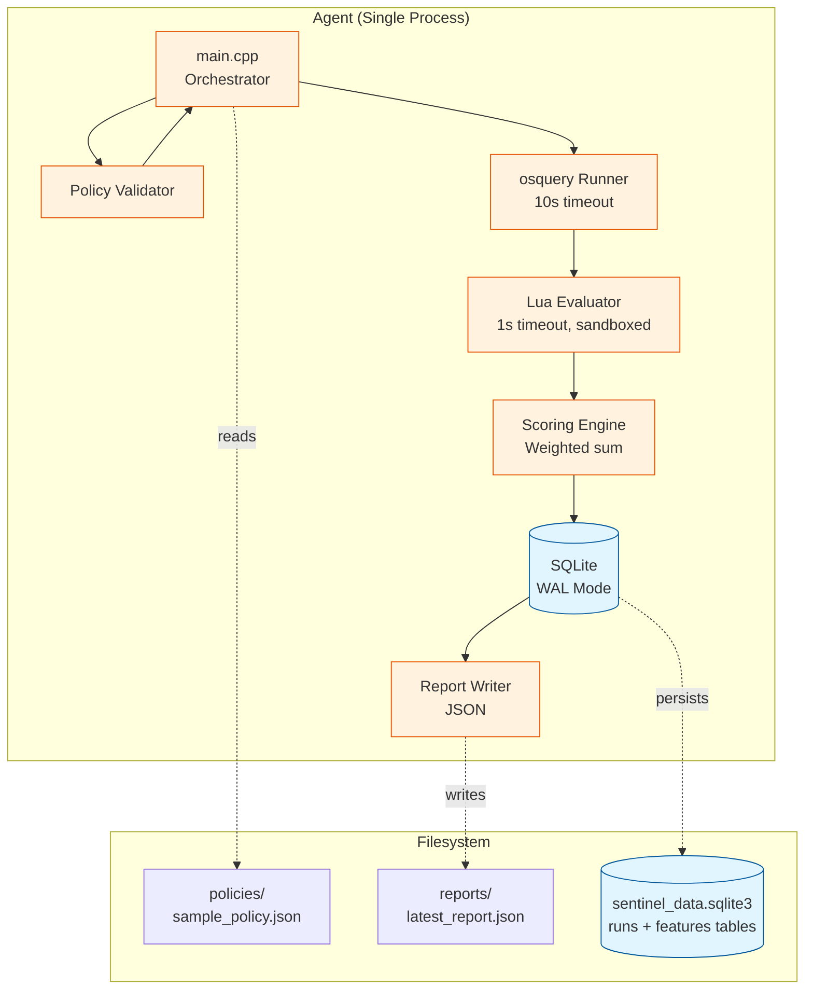

# Sentinel Architecture (Current Implementation)

Local security compliance evaluation agent with deterministic policy execution and durable persistence.

## System Architecture (Phase 1 - Implemented)



## Components (Current)

### **main.cpp** - Agent Orchestrator
- **Purpose**: Controls evaluation lifecycle, error handling, resource cleanup
- **Responsibilities**:
  - Command-line argument parsing
  - Policy file loading
  - Orchestrate evaluation pipeline
  - Exception handling and logging
  - Exit code determination
- **LOC**: ~150 lines

### **Policy Validator**
- **Purpose**: Parse and validate JSON policy files
- **Validation**:
  - JSON schema correctness
  - Required fields present
  - Rule structure well-formed
  - Lua syntax check (basic)
- **Failures**: Invalid JSON → graceful error + exit code 1

### **osquery Runner** (osquery_runner.cpp)
- **Purpose**: Execute osquery data collection with timeout enforcement
- **Implementation**:
  - Spawns `osqueryi.exe` subprocess
  - 10-second timeout (SIGTERM then SIGKILL)
  - Captures stdout/stderr
  - Parses JSON output
- **Failures**: Timeout → empty results, osquery crash → logged + continue
- **LOC**: ~120 lines

### **Lua Evaluator** (lua_evaluator.cpp)
- **Purpose**: Execute rule logic in sandboxed Lua runtime
- **Sandboxing**:
  - No file I/O (`io` library disabled)
  - No network (`socket` disabled)
  - No process spawn (`os.execute` disabled)
  - 1-second timeout via instruction count limit
- **Input**: osquery results (JSON → Lua table)
- **Output**: Boolean (rule pass/fail)
- **Failures**: Timeout → rule fails, Lua error → logged + rule fails
- **LOC**: ~180 lines

### **Scoring Engine** (scoring.cpp)
- **Purpose**: Compute weighted score from rule results
- **Algorithm**:
  ```
  score = SUM(rule.weight IF rule passed)
  max_possible = SUM(all rule weights)
  percentage = (score / max_possible) * 100
  ```
- **Output**: Integer score (0-100)
- **LOC**: ~60 lines

### **SQLite Database** (db.cpp)
- **Purpose**: Durable persistence with crash-safe guarantees
- **Configuration**:
  - WAL mode (`PRAGMA journal_mode=WAL`)
  - Atomic transactions (`BEGIN IMMEDIATE; ... COMMIT;`)
  - Foreign key constraints enforced
- **Schema**:
  ```sql
  CREATE TABLE runs (
    id INTEGER PRIMARY KEY AUTOINCREMENT,
    ts TEXT NOT NULL,            -- ISO-8601 timestamp
    hostname TEXT,
    policy TEXT,
    score INTEGER,
    details_json TEXT            -- Full evaluation details
  );
  
  CREATE TABLE features (
    run_id INTEGER PRIMARY KEY,
    firewall_enabled INTEGER,
    av_installed INTEGER,
    FOREIGN KEY(run_id) REFERENCES runs(id)
  );
  ```
- **Guarantees**: WAL ensures durability, atomic transactions prevent partial writes
- **LOC**: ~150 lines

### **Report Writer**
- **Purpose**: Generate JSON report files
- **Output Format**:
  ```json
  {
    "policy": "policy-name",
    "score": 75,
    "details": { "rule_id": true/false },
    "timestamp": "2026-02-18T10:30:00.123Z",
    "hostname": "MACHINE-NAME"
  }
  ```
- **Location**: `reports/latest_report.json`
- **Failures**: Disk full → logged, but doesn't prevent database persistence

---

## Data Flow (Current)

```
1. Parse CLI args → policy file path
2. Load policy JSON → validate schema
3. For each rule:
   3a. Execute osquery (timeout 10s)
   3b. Parse JSON results
   3c. Evaluate Lua code (timeout 1s, sandboxed)
   3d. Record pass/fail
4. Compute weighted score
5. BEGIN TRANSACTION
6. INSERT INTO runs (...)
7. INSERT INTO features (...)
8. COMMIT
9. Write JSON report file
10. Exit (code 0 if success)
```

---

## Persistence Guarantees (Current)

### What SQLite WAL Provides

**Atomicity**: Transaction either fully commits or fully rolls back (no partial writes)

**Durability**: Once `COMMIT` returns, data survives power loss (WAL fsync)

**Isolation**: Readers see consistent snapshot (MVCC via WAL)

**Crash Recovery**: WAL checkpoint on next open replays committed transactions

### What Is NOT Guaranteed

- **No Delivery**: Reports only persisted locally, not sent anywhere
- **No Retry**: If persistence fails (disk full), evaluation lost
- **No Deduplication**: Multiple runs with identical results create separate rows
- **No Crash Recovery for In-Flight Evals**: If killed during osquery execution, eval lost

---

## Resource Bounds (Enforced)

| Resource | Limit | Enforcement | Failure Mode |
|----------|-------|-------------|--------------|
| **osquery CPU** | 10s timeout | Process kill (SIGTERM → SIGKILL) | Empty results, evaluation continues |
| **Lua CPU** | 1s timeout | Instruction count hook | Rule fails, evaluation continues |
| **Lua Memory** | Process heap limit | Lua allocator | Out-of-memory → Lua error |
| **osquery Output** | 1MB | Stdout buffer truncation | Parsed as much as fits |
| **SQLite Disk** | Filesystem limit | Write failure on disk full | Transaction aborted, eval fails |
| **Policy File Size** | 10MB | fread size check | File too large → validation error |

---

## Error Handling (Current)

### Recoverable Errors (Continue Evaluation)

- osquery timeout → empty results, Lua sees empty table
- Lua timeout → rule marked as failed
- Lua runtime error (e.g., nil access) → rule fails, logged
- Single rule failure → other rules still evaluated

### Terminal Errors (Exit Immediately)

- Policy file not found → exit code 1
- Policy JSON malformed → exit code 1
- SQLite database locked (concurrent access) → exit code 1
- Disk full during persistence → exit code 1

---

## Performance (Observed During Local Testing)

**Hardware**: Windows 10, i7-8750H (6 cores), 16GB RAM, SSD

**Execution**:
- Policy validation: <1ms
- osquery (3 queries): 150ms average
- Lua evaluation (5 rules): 2ms total
- SQLite transaction: 3ms (WAL mode)
- **Total**: ~160ms per evaluation

**Resource Usage**:
- CPU: 3% average (spikes to 25% during osquery)
- Memory: 45MB RSS (stable)
- Disk I/O: ~2 writes/sec (WAL checkpoints)

**Capacity**:
- Evaluations/sec: ~6 (limited by osquery, not Sentinel)
- Typical use case: 1 eval/5min = 0.003/sec (far below capacity)
- SQLite: Handles 10k writes/sec (single agent needs ~0.003/sec)

---

## Design Principles

1. **Fail-Safe Defaults**: Errors default to "fail" (rule fails, score reduced) not "crash"
2. **Resource Bounds**: Every external operation has timeout to prevent hangs
3. **Separation of Concerns**: Policy, data, logic, persistence all separate modules
4. **Crash-Safe Persistence**: WAL mode ensures durability, no partial writes
5. **Offline-First**: No network dependency, works in air-gapped environments
6. **Observable**: All errors logged (spdlog), exit codes meaningful

---

## Current Limitations

### By Design (Intentional Constraints)

- **No Delivery**: Phase 1 only does local evaluation
- **No Retry Logic**: Failed evaluations are not retried
- **No Distributed Coordination**: Single-agent only
- **Windows-Only**: Windows Security Center queries, `osqueryi.exe` paths

### Technical Debt (Could Improve)

- **Hardcoded Paths**: osquery binary path not configurable
- **Limited Testing**: No automated test suite (manual testing only)
- **Basic Logging**: spdlog used but minimal structured logging
- **No Metrics**: No Prometheus/StatsD instrumentation

---

## Future Extensions (Phase 2 - Not Implemented)

See [`docs/roadmap/`](../docs/roadmap/) for planned delivery layer:

- Durable retry queue
- SHA-256 content hashing
- MQTT/HTTP delivery abstraction
- Crash recovery for delivery
- Idempotent backend

**Phase 2 is fully planned but not yet implemented.**

---

## Source Files

| File | Purpose | LOC |
|------|---------|-----|
| `src/main.cpp` | Orchestration, error handling | ~150 |
| `src/osquery_runner.cpp` | osquery execution with timeout | ~120 |
| `src/lua_evaluator.cpp` | Sandboxed Lua runtime | ~180 |
| `src/scoring.cpp` | Weighted score computation | ~60 |
| `src/db.cpp` | SQLite persistence (WAL) | ~150 |
| `src/json_to_lua.cpp` | JSON → Lua table conversion | ~80 |
| **Total** | | **~740 LOC** |

---

## Dependencies

- **nlohmann/json**: JSON parsing (header-only)
- **sol2**: Lua C++ bindings (header-only)
- **spdlog**: Logging
- **sqlite3**: Embedded database
- **lua**: Lua 5.4 runtime

All installed via vcpkg.

---

This architecture demonstrates clean separation of concerns, crash-safe persistence, and resource-bounded execution without network layer complexity.
