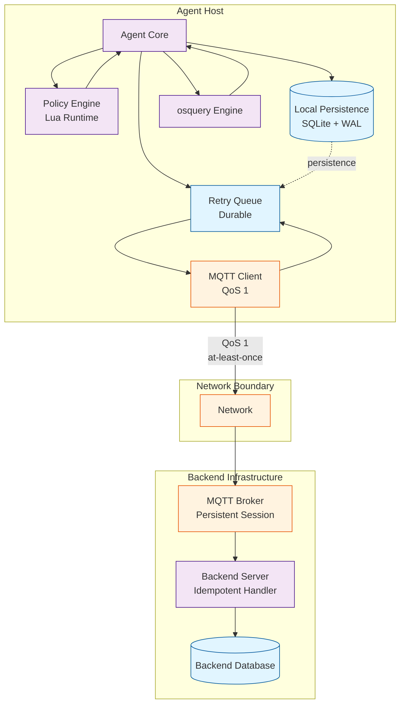

# Sentinel Architecture

Production-grade distributed agent for security compliance monitoring with at-least-once delivery, crash-safe persistence, and offline-first operation.

## System Architecture

## Components

**Agent Core**: Orchestrates evaluation lifecycle, state transitions, persistence, crash recovery.

**Policy Engine**: Sandboxed Lua runtime for deterministic rule evaluation.

**Local Persistence**: SQLite with WAL, atomic transactions, content-addressable deduplication.

**Retry Queue**: Durable (SQLite), exponential backoff, crash-safe.

**MQTT Client**: QoS 1, persistent session (clean_session=false), auto-reconnect.

**osquery**: System data collection, 10s timeout, 1MB output limit.

## Data Flow

**Normal**: Policy (MQTT) → Persist → osquery → Lua eval → Score → Persist report → Queue → MQTT publish → PUBACK → Mark delivered

**Crash Recovery**: Load retry queue → Reconnect MQTT → Replay pending → Resume

## Persistence

**Agent (SQLite)**: Policies, evaluations, retry queue, delivery status.

**Network (MQTT)**: Policy updates (backend→agent), reports (agent→backend).

**Backend (DB)**: Aggregated trends, device inventory, policy history.

## Network Guarantees

**Agent→Broker**: QoS 1, persistent session, content-hash deduplication.

**Broker→Backend**: Durable subscription, idempotent handler, hash-based duplicate detection.

## Design Principles

1. Offline-first operation
2. Crash-safe persistence
3. Idempotent backend
4. Explicit state machine
5. Bounded resources
6. Fail-safe defaults

## Scale

**Target**: 100k agents, 5-60min interval, Mosquitto/HiveMQ/AWS IoT Core.

**Bottlenecks**: SQLite ~10k writes/sec, broker ~50k connections, backend dedup overhead.

**Future**: RocksDB for writes, broker sharding, bloom filters for dedup.
