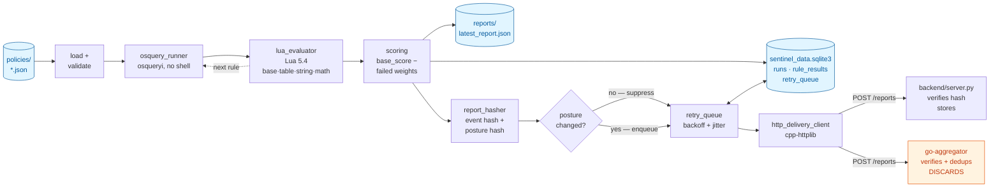

# Sentinel Architecture

Sentinel is a host security-compliance agent. It collects operating-system state
with osquery, evaluates policy rules written in Lua, scores the result, persists
it locally, and delivers it to a backend with at-least-once semantics.

It is a single-process agent plus two independent receivers. It is not a
distributed system, there is no fleet coordination, and it has one agent per
host with no clustering.

Everything below describes code that exists. Claims about bounds and guarantees
say explicitly where enforcement is partial, and [Known gaps](#known-gaps) lists
what is not true yet. That section is the honest counterpart to this one; read
both.

---

## System shape



The agent talks to **one** backend URL at a time (`--backend-url`). The Python
backend and the Go aggregator implement the same `POST /reports` contract; they
are alternatives, not a pipeline. The Go service is shaded because it verifies
and deduplicates but **discards** accepted reports — it has no storage layer yet.

---

## Execution flow

Order matters here and differs from what you might assume:

1. **Crash recovery first.** With `--enable-delivery`, the agent opens the
   database and retries anything left `PENDING` by a previous run *before*
   evaluating anything. A crashed agent resumes delivery on restart.
2. Load and validate the policy. Malformed policy is terminal, exit 1.
3. For each rule: run osquery, convert rows to a Lua table, evaluate the rule's
   Lua to a boolean. A rule that errors or times out is recorded as **failed**,
   and evaluation continues to the next rule.
4. Score: `base_score`, minus the weight of every failed rule, clamped to 0–100.
5. Assemble the report and print it to stdout.
7. **Write `reports/latest_report.json`** — this happens *before* the database
   write, so a report file can exist for a run that was never persisted.
7. Persist to SQLite: `runs` + `rule_results` in one `BEGIN IMMEDIATE`/`COMMIT`.
8. If delivery is enabled, decide whether to report at all (below), then enqueue
   and attempt immediate delivery.

Steps 6, 7 and 8 are each best-effort and independently wrapped: a failure in
any of them is logged and the agent continues, because losing a report file is
not a reason to lose the database row.

---

## The two hashes

This is the central design decision, and the thing most worth understanding.

| | `posture_hash` | `report_hash` (event hash) |
|---|---|---|
| Covers | `policy`, `score`, `details` | the whole report, **including `timestamp`** |
| Answers | "has the state changed?" | "which report is this?" |
| Scope | agent-local, never transmitted | sent on the wire, receivers recompute it |
| Excludes | `timestamp`, `hostname` | nothing |

**Why two.** A single hash cannot answer both questions. Covering `timestamp`
makes every hash unique, so it can identify a specific report but can never
detect that nothing changed. Excluding `timestamp` detects change but collapses
distinct events: a host whose posture goes A → B → A would have its return to A
silently dropped as a duplicate, which is exactly the transition a security
product exists to record.

`hostname` is excluded from posture deliberately: it is identity, not posture.
Including it would make renaming a machine look like a security state change.

**State-change-triggered reporting.** Before enqueueing, the agent compares the
current `posture_hash` against the last posture it committed to reporting. If
they match, nothing is sent. Local evaluation and persistence still happen on
every run — only delivery is suppressed. On a fleet whose posture is almost
always static, unconditional reporting is nearly all of the traffic.

**Where "last reported posture" comes from.** Not a separate state table — it is
derived from the queue itself:

```sql
SELECT posture_hash FROM retry_queue
WHERE state IN ('PENDING', 'DELIVERED') AND posture_hash IS NOT NULL
ORDER BY run_id DESC LIMIT 1
```

Excluding `FAILED` is load-bearing. A report whose delivery was permanently
abandoned was never actually reported, so it must not suppress the next attempt;
excluding it means the next evaluation re-reports that posture automatically,
with no reset bookkeeping. `posture_hash IS NOT NULL` covers the upgrade path, so
a row written before the column existed cannot wrongly suppress the first report
after an upgrade. Ordering is by `run_id`, not `created_at`, because
`datetime('now')` has one-second resolution and two runs in the same second would
be ambiguous.

### Canonicalization is a cross-language contract

The agent computes `report_hash`; both receivers recompute it from the report
they parsed and reject a mismatch. So the exact bytes hashed are a contract
between three independently written JSON encoders (nlohmann, `json.dumps`,
`encoding/json`), which do **not** agree by default — they differ on non-ASCII
escaping, HTML escaping and number formatting. A disagreement does not fail
loudly; it makes every affected report return `400 hash mismatch` indefinitely.

[`tests/canonicalization`](../tests/canonicalization/README.md) enforces this
against shared fixtures and documents the two number cases that lie outside the
supported range. Both hashes share one canonicalizer, so any encoding change
surfaces there.

---

## Delivery

```
enqueue ──▶ PENDING ──delivered──▶ DELIVERED (terminal)
               │
               ├──transient failure──▶ PENDING with next_retry_at, attempts+1
               │
               └──attempts > max_retries──▶ FAILED (terminal)
```

Backoff is `min(300, 2^attempts)` seconds with ±25% jitter, so retries do not
synchronise across a fleet. `max_retries` defaults to 10.

`load_pending_reports()` returns `PENDING` rows whose `next_retry_at` has passed,
which is both the normal retry path and the crash-recovery path — there is no
separate recovery mechanism.

**Enqueue is idempotent.** `INSERT ... ON CONFLICT(report_hash) DO NOTHING`,
returning whether a row was inserted. Re-queueing an already-queued report is
what an at-least-once producer does when it cannot tell whether the first attempt
landed; treating it as an error would turn a benign retry into a failure.

**HTTP 409 counts as success.** A duplicate at the receiver means the report
already arrived, so the agent marks it delivered rather than retrying forever.
This is what turns at-least-once transport into effectively-once storage.

### What actually holds

- **Durability after commit.** Once the SQLite transaction commits, the run
  survives a crash or power loss (WAL + fsync).
- **At-least-once delivery.** A report that is enqueued is retried until
  delivered or until retries are exhausted.
- **Effectively-once storage**, via receiver-side dedup on `report_hash`.
- **Atomic state transitions.** Each transition is one `UPDATE`.
- **Valid states only.** A `CHECK` constraint restricts `state` to the three
  values.

### What does not hold

- **No ordering.** Reports may arrive out of order; nothing sequences them.
- **No exactly-once.** The receiver may see the same report twice and must
  deduplicate.
- **No delivery guarantee before persistence.** A crash between step 7 and
  step 8 leaves a persisted run that was never queued. It is not retried,
  because only queued reports are recoverable.
- **No liveness signal.** Suppression means silence is ambiguous: a healthy
  agent with unchanged posture and a dead agent look identical. There is no
  heartbeat yet. A receiver could flag an agent stale after some interval, but
  nothing does.
- **No report authenticity.** Agents are trusted. A compromised host can forge
  reports; there is no signing and no client certificate.

### Failure scenarios

| Scenario | Detected by | Behaviour |
|---|---|---|
| Backend down / network partition | connection refused or timeout | Report stays `PENDING`, exponential backoff, drains on reconnect |
| Crash before delivery | `PENDING` rows found at next startup | Retried automatically — same code path as normal retry |
| Crash after send, before response | nothing — the agent cannot tell | Report is re-sent; receiver dedups on `report_hash` and answers `409` |
| Receiver rejects with 4xx | HTTP status | Terminal for that report; counted as an attempt, not retried indefinitely |
| Retries exhausted | `attempts > max_retries` | `FAILED`; posture is re-reported on the next evaluation because the suppression query skips `FAILED` |
| Corrupt database | `SQLITE_CORRUPT` on open or query | **Not handled.** The agent throws and exits; no `integrity_check` or recovery path |
| Large backlog after long outage | queue depth | **Not handled.** All ready reports are drained in one pass with no rate limit |

---

## Data model

```sql
CREATE TABLE runs (                    -- one row per evaluation, always written
  id INTEGER PRIMARY KEY AUTOINCREMENT,
  ts TEXT NOT NULL,                    -- ISO-8601 UTC, milliseconds
  hostname TEXT,
  policy TEXT,
  score INTEGER,
  details_json TEXT                    -- {rule_id: bool}
);

CREATE TABLE rule_results (             -- one row per (run, rule); not one column
  run_id INTEGER NOT NULL,             -- per rule name, so any policy on any
  rule_id TEXT NOT NULL,               -- platform needs no schema change to
  passed INTEGER NOT NULL,             -- introduce a new rule id
  weight INTEGER NOT NULL,             -- weight as applied to this run
  PRIMARY KEY (run_id, rule_id),
  FOREIGN KEY(run_id) REFERENCES runs(id)
);

CREATE TABLE retry_queue (             -- one row per report committed for delivery
  run_id INTEGER PRIMARY KEY,
  report_hash TEXT UNIQUE NOT NULL,    -- event hash: whole report incl. timestamp
  posture_hash TEXT,                   -- posture only; NULL on pre-upgrade rows
  report_json TEXT NOT NULL,           -- exact bytes to send
  attempts INTEGER DEFAULT 0,
  state TEXT NOT NULL CHECK (state IN ('PENDING','DELIVERED','FAILED')),
  next_retry_at TEXT,
  created_at TEXT NOT NULL,
  delivered_at TEXT,
  failed_at TEXT,
  last_error TEXT,
  FOREIGN KEY(run_id) REFERENCES runs(id)
);
```

Two things to know about this schema:

**`rule_results` replaced an earlier `features` table** that hardcoded
`firewall_enabled`/`av_installed` as literal SQL columns, populated only when a
policy's rule ids happened to match those exact names -- silently dropping
every other rule's outcome, and assuming rule ids are shared across platforms
when policies are actually per-device (`policies/macos_policy.json` and
`policies/sample_policy.json` share only two of their combined seven rule ids
by convention, not by any enforced contract). `rule_results` needs no schema
change when any future policy on any platform introduces a new rule id; the
full outcomes map is also still recorded in `runs.details_json`, unchanged.
`weight` is captured at evaluation time, from the policy as it was actually
applied to that run, not looked up later from a policy file that may since
have changed.

**Foreign keys are declared but not enforced.** SQLite defaults
`foreign_keys=OFF` and the agent only sets `journal_mode=WAL`, so these
constraints currently document intent rather than enforcing it.

Schema changes are applied additively: `CREATE TABLE IF NOT EXISTS`, plus a
guarded `ALTER TABLE ... ADD COLUMN` for `posture_hash` that checks
`PRAGMA table_info` first so it is idempotent. The one deliberate exception is
the old `features` table, which `init_schema()` now drops unconditionally on
every startup (`DROP TABLE IF EXISTS`, which never errors on a database that
never had it): it did not just go unused, it actively returned wrong data for
any rule outside its two hardcoded columns, so wrong-and-present was judged
worse than dropped, with nothing else reading it to migrate forward. There is
no versioned migration framework yet.

---

## Resource bounds

| Resource | Bound (claimed or intended) | Actually enforced? |
|---|---|---|
| osquery wall time | 10s | **Windows only.** `WaitForSingleObject` bounds it. On POSIX the check sits inside the read loop, so it only fires while output is flowing — a silently hanging `osqueryi` blocks in `read()` indefinitely |
| osquery output | 1 MB | Yes, but same caveat: checked per read |
| osquery process cleanup | kill on breach | `SIGKILL` / `TerminateProcess` directly, with no `SIGTERM` grace period |
| Lua CPU time | 1s (claimed by earlier docs) | **No. Not enforced at all.** See below |
| Lua memory | — | Not bounded; the default allocator is used |
| Lua library surface | no I/O | Yes — only `base`, `table`, `string`, `math` are opened, so `io`, `os` and `package` are absent |
| Policy file size | — | Not checked. Only `query` length (4096 chars) is validated |
| Delivery attempts | 10 | Yes, then `FAILED` |
| HTTP request | 30s | Yes — connection, read and write timeouts via cpp-httplib |

**The Lua timeout does not exist.** There is no `lua_sethook`, no instruction
counter and no wall-clock check in `lua_evaluator.cpp`. Measured directly: a rule
running a 3-billion-iteration loop ran for 9.75 seconds and returned normally
rather than being aborted. A policy containing `while true do end` hangs the
agent forever. Since policies are data that the evaluation loop executes, this is
the most significant gap in the system.

The library restriction is real and worth stating precisely: those four libraries
are simply never opened, which is stronger than disabling functions after the
fact. But a restricted library surface is not a CPU bound, and it is not a
security boundary — policy authorship must be trusted.

---

## Receivers

Both implement the same contract: `POST /reports` with
`{"report": {...}, "hash": "<sha256-hex>"}`, recompute the hash over the report's
canonical form, and reject a mismatch with `400`.

**`backend/server.py`** (FastAPI). Verifies the hash, returns `409` for a
`report_hash` already stored, otherwise inserts into `received_reports` and
returns `200`. Canonicalization lives in `backend/canonical.py`, which has no
FastAPI or database imports so it can be tested in isolation. SQLite path is
hardcoded relative to the working directory.

**`go-aggregator`** (Go). Verifies the hash, deduplicates against a bounded LRU
of recently seen hashes, returns `409` on a hit and `200` otherwise — and then
drops the report. There is **no storage layer, no metrics endpoint and no
Dockerfile**, so it is currently less functional than the Python backend it was
intended to replace. `internal/canonical` holds the encoder, shared between the
handler and the differential test.

Neither receiver authenticates requests.

---

## Known gaps

Ordered by how much they matter:

1. **No Lua CPU bound** — a policy can hang the agent indefinitely.
2. **No heartbeat** — with suppression active, silence cannot distinguish a
   healthy agent from a dead one. This is the direct consequence of
   state-change-triggered reporting and the next thing to build.
3. **The retry queue is unbounded** — no size cap, no age cutoff, and terminal
   `DELIVERED`/`FAILED` rows are never pruned. Each row holds the full report
   JSON, so an agent that cannot reach its backend grows the table indefinitely.
   Suppression reduces the rate but does not bound it: a host whose posture
   flaps produces a real change every cycle with nowhere to send it.
4. **Go aggregator does not persist anything** — accepted reports are discarded.
5. **No transport security or authentication** — plain HTTP, no API keys; TLS
   would have to terminate at a reverse proxy.
6. **POSIX osquery timeout is best-effort** — see the bounds table.
7. **Foreign keys not enforced** — `PRAGMA foreign_keys=ON` is never set.
8. **No versioned migrations** — additive changes only.
9. **Traffic reduction is unmeasured.** The mechanism works and is tested, but
   no benchmark exists, and any figure must count heartbeat overhead once
   heartbeats exist, or it measures "stopped sending" rather than "sent less".
10. **`src/json_to_lua.cpp` is orphaned** — not listed in `CMakeLists.txt`, so it
   is never compiled at all; `lua_evaluator.cpp` has its own private converter.
11. **No MQTT client** — the `DeliveryClient` interface exists to allow one.

---

## Component reference

| File | Role |
|---|---|
| `src/main.cpp` | Orchestration, CLI, crash recovery, suppression decision |
| `src/osquery_runner.cpp` | Spawns `osqueryi` without a shell, captures stdout |
| `src/lua_evaluator.cpp` | Sandboxed Lua 5.4 via sol2; JSON rows → Lua table |
| `src/scoring.cpp` | `base_score` minus failed weights, clamped 0–100 |
| `src/db.cpp` | SQLite (WAL), schema, retry-queue operations |
| `src/report_hasher.cpp` | Canonical JSON + SHA-256; event and posture hashes |
| `src/delivery_client.cpp` | `DeliveryClient` interface + `MockDeliveryClient` |
| `src/http_delivery_client.cpp` | HTTP POST via cpp-httplib |
| `src/retry_queue.cpp` | Backoff, jitter, state transitions |
| `src/json_to_lua.cpp` | Orphaned, not built — see gap 9 |
| `backend/canonical.py` | Canonical JSON + SHA-256 (Python side of the contract) |
| `backend/server.py` | FastAPI receiver with hash dedup |
| `go-aggregator/internal/canonical/` | Canonical JSON + SHA-256 (Go side) |
| `go-aggregator/internal/dedup/` | Bounded LRU of seen hashes |
| `go-aggregator/internal/handler/` | `POST /reports` |

Tests: `test_delivery_foundation.cpp` (hashing, queue, suppression, flapping,
failure re-reporting), `test_lua_evaluator.cpp` (rule logic, no osquery needed),
`tests/canonicalization/` (three-language hash agreement).

---

## Platform and dependencies

macOS (Homebrew + CMake) and Windows (x64, vcpkg + MSBuild) are both built and
tested on every push. The source is genuinely cross-platform, not just
nominally so: only about 10% of it sits inside `#ifdef _WIN32`, almost
entirely in `osquery_runner.cpp`'s process-spawning code (`CreateProcess` vs
`posix_spawn`), which necessarily differs by OS.

Windows CI briefly went manual-only (`workflow_dispatch`) on the reasoning
that active development is macOS-only and both real failures that workflow
had hit were in the Windows *toolchain* rather than this code — an unpinned
vcpkg dependency silently drifting to a new upstream version, and a stale
GitHub Actions cache skipping `git clone` entirely and never fetching a newly
referenced commit. That was reverted. Both were one-time bootstrapping bugs
with durable fixes (`builtin-baseline` + `overrides` in `vcpkg.json`; an
unconditional `git fetch` in the workflow), not ongoing fragility, and a
project that states a cross-platform claim needs continuous evidence for it,
not a claim nobody is checking after the first two failures got fixed. It is
also the only thing that would catch a POSIX-only regression introduced from
macOS-only work before it ships, rather than whenever someone next happens to
run the workflow by hand. Linux presets exist but are untested. Policies are
**not** portable regardless of platform support — each rule carries an osquery
query, and the tables differ per OS.

Lua is pinned to 5.4 on both platforms because policy rules are Lua source
shipped as data, so the language version is part of the policy contract. CMake
runs an ABI probe at configure time that fails the build if the Lua headers and
the linked library disagree; this exists because sol2 resolves `<lua/lua.h>`
before `<lua.h>`, so a second Lua installation on the include path can silently
be compiled against while a different one is linked, producing a runtime panic on
first policy evaluation rather than a build error.

Dependencies: nlohmann/json, sol2, spdlog, sqlite3, Lua 5.4, cpp-httplib;
FastAPI + pydantic for the Python backend; `hashicorp/golang-lru` for Go.
